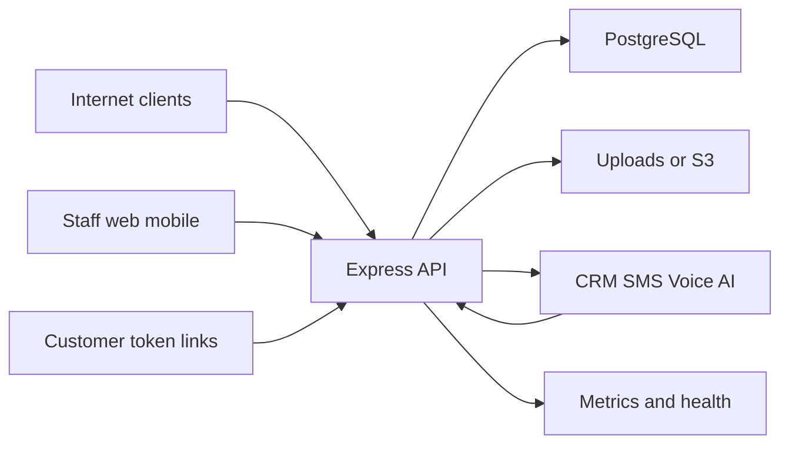

# Arbor API threat model

## Executive summary
Najwieksze ryzyka dla API Arbor sa w czterech obszarach: publiczne tokeny/linki bez JWT, webhooki CRM/telefonii, uploady i publiczny storage plikow oraz konsekwentnosc autoryzacji per rola/oddzial/ekipa. Kod ma dobre podstawy: JWT, role, Zod, parametryzowane zapytania PostgreSQL, Helmet, wybrane rate-limity i testy RBAC. Najbardziej oplacalny przeglad manualny to sprawdzenie publicznych tras, webhookow i kazdej trasy, ktora nie uzywa centralnego `router.use(authMiddleware)`.

## Scope and assumptions
In-scope paths:
- `os/src/app.js`
- `os/src/routes`
- `os/src/middleware`
- `os/src/services`
- `os/src/config`
- runtime deploy config in `render.yaml`, `railway.json`, `vercel.json`, `netlify.toml`

Out of scope:
- frontend-only UI bugs in `web/src`, except where they expose API assumptions
- mobile local/offline logic in `mobile`, except as API client context
- CI/dev scripts, unless they affect production secrets or deployment

Assumptions:
- API is internet-exposed behind a reverse proxy such as Render/Koyeb/Vercel/Netlify.
- PostgreSQL is the primary data store.
- JWT Bearer tokens are the primary auth mechanism for employees/operators.
- Customer-facing flows rely on opaque bearer-by-possession links.
- Data sensitivity is medium/high: customers, addresses, phones, GPS, job photos/documents, invoices/payroll, CRM messages, telephony metadata/recordings.

Open questions that can change ranking:
- Are `CORS_ORIGINS`, `PUBLIC_BASE_URL`, webhook secrets, and Twilio signature validation enforced in production?
- Are uploads served from local disk or S3/CDN, and are uploaded objects meant to be publicly readable?
- Is this single-company/single-tenant, or can multiple branches/customers be treated as security tenants?

## System model
### Primary components
- Express API server: main runtime in `os/src/app.js`.
- PostgreSQL: shared application database via `os/src/config/database.js`.
- Auth/RBAC middleware: JWT verification and role helpers in `os/src/middleware/auth.js`.
- Public customer endpoints: quote acceptance and tracking in `os/src/routes/quotation-public.js`, `os/src/routes/track.js`, and public time-window routes in `os/src/routes/tasks.js`.
- Webhook endpoints: CRM/Kommo/Twilio/Zadarma in `os/src/routes/crmWebhooks.js`, `os/src/routes/kommoQuotationWebhook.js`, `os/src/routes/sms-webhooks.js`, `os/src/routes/telefon-webhooks.js`.
- Upload/storage layer: multer in task/quotation routes and storage abstraction in `os/src/services/upload-storage.js`. Task photos/documents have controlled download endpoints with scoped short-lived access tokens; production static serving can block private task upload folders.
- External providers: Kommo/CRM, Twilio/Zadarma, AI providers, S3/Google Drive, SMTP/Telegram/Expo push.

### Data flows and trust boundaries
- Internet users -> Express API: HTTP JSON/form/multipart, protected by route-level auth, public tokens, or webhook secrets depending on route.
- Express API -> PostgreSQL: SQL through `pg`, mostly parameterized queries; DB credentials from env.
- Authenticated staff/mobile clients -> API: JWT Bearer token, role and branch/team constraints.
- Customer link holder -> public endpoints: opaque token in URL, no login; returns limited customer-facing data or mutates quote/time-window state.
- External SaaS -> webhook endpoints: provider payloads cross from untrusted internet into task/CRM/SMS/telephony state.
- API -> external providers: outbound HTTP for Kommo, SMS/voice, AI, geocoding, push/email, and optional remote attachment download.
- API -> storage/uploads: multipart and remote attachments become public `/uploads` or S3 objects depending on env.

Security guarantees observed:
- Helmet is enabled, but CSP is disabled in `os/src/app.js`.
- CORS defaults to wildcard when `CORS_ORIGINS` is absent.
- JSON body limit is 10 MB globally.
- `/uploads` is served as static files, with private task folders blockable via production upload policy; task media should be consumed through `download_url`.
- Login and selected costly routes are rate-limited.
- JWT verification requires `JWT_SECRET`; production fails closed if missing.
- Kommo quotation/task webhooks fail closed when `KOMMO_QUOTATION_WEBHOOK_SECRET` is missing.
- Twilio webhook signature validation is conditional on `PUBLIC_BASE_URL`, `TWILIO_AUTH_TOKEN`, and skip flags.

#### Diagram

## Assets and security objectives
| Asset | Why it matters | Security objective (C/I/A) |
| --- | --- | --- |
| JWT secret and tokens | Compromise gives account/session impersonation | C/I |
| User accounts and roles | Drives authorization, branch scope, payroll visibility | C/I |
| Customers, addresses, phones, GPS | PII and operational privacy | C/I |
| Tasks, quotes, schedules | Integrity-critical operational state | I/A |
| Payroll, invoices, finance | Sensitive financial data | C/I |
| Photos, documents, recordings | Sensitive field evidence and customer data | C/I |
| Webhook secrets and provider tokens | Can mutate state or spend money via integrations | C/I/A |
| AI/SMS/voice providers | Cost and abuse risk | A/I |
| Audit logs and metrics | Incident response and accountability | I/A |

## Attacker model
### Capabilities
- Remote unauthenticated user can send HTTP requests to public endpoints.
- Remote attacker can obtain or guess leaked customer/status/token URLs if tokens are logged, forwarded, or shared.
- Low-privileged authenticated employee can call API endpoints allowed by their JWT role.
- External webhook sender can replay, spoof, or mutate provider payloads if secrets/signatures are weak or disabled.
- Attacker can upload files where authorized, and can attempt large payloads or malicious content.

### Non-capabilities
- No direct filesystem or database shell access assumed.
- No ability to read env vars unless app/deploy is otherwise compromised.
- No compromise of Twilio/Kommo/S3/AI provider accounts assumed.
- No physical device compromise assumed for mobile clients.

## Entry points and attack surfaces
| Surface | How reached | Trust boundary | Notes | Evidence |
| --- | --- | --- | --- | --- |
| Auth login/reset | `/api/auth/*` | Internet -> API -> DB/email | Login has rate limit; reset token emailed | `os/src/routes/auth.js`, `os/src/middleware/rate-limit.js` |
| Authenticated API | `/api/tasks`, `/api/crm`, `/api/wyceny`, etc. | Staff/mobile -> API -> DB | Route-level JWT and per-route RBAC/access checks | `os/src/app.js`, `os/src/middleware/auth.js` |
| Customer quote acceptance | `/api/public/quotations/:token` | Link holder -> API -> DB | Public bearer URL can create task on accept | `os/src/routes/quotation-public.js` |
| Customer tracking | `/track/:token` | Link holder -> API -> DB | Public bearer URL exposes limited job info and map | `os/src/routes/track.js` |
| Public time-window decisions | `/api/tasks/time-window/:token` | Link holder -> API -> DB | No JWT; token controls scheduling decision | `os/src/routes/tasks.js` |
| CRM generic webhooks | `/api/webhooks/crm/:token` | External SaaS -> API -> DB | Token in path authenticates app | `os/src/routes/crmWebhooks.js` |
| Kommo webhooks | `/api/webhooks/kommo/*` | External SaaS -> API -> DB/storage/geocode | Shared secret and idempotency events | `os/src/routes/kommoQuotationWebhook.js` |
| SMS/voice webhooks | `/api/sms/webhooks/*`, `/api/telefon/webhooks/*` | Provider -> API -> DB/pipeline | Twilio validation is conditional; Zadarma status is unsigned in observed route | `os/src/routes/sms-webhooks.js`, `os/src/routes/telefon-webhooks.js` |
| Uploads and static files | `/uploads`, task photo/document routes | Auth user/webhook -> storage -> controlled download | Task media has auth/scoped-token download URLs; static private folders should be blocked in production | `os/src/app.js`, `os/src/routes/tasks.js` |
| Metrics/health/db-test/docs | `/api/metrics`, `/api/ready`, `/api/db-test`, `/api/docs/openapi.yaml` | Internet -> API | Metrics protected only when enabled and token configured; db-test auth in prod | `os/src/app.js` |

## Top abuse paths
1. Attacker gets a customer quote token from logs/referrer/email forwarding -> opens quote page -> accepts/rejects offer -> creates or changes operational tasks.
2. Attacker gets a public tracking token -> reads service address, planned date, branch contact, map pin, and timeline -> uses it for privacy or physical-risk abuse.
3. Attacker spoofs or replays webhook payloads where signature/secret validation is missing or disabled -> changes SMS delivery, call recording state, CRM leads, or task sync.
4. Attacker with low-privileged JWT finds an endpoint missing `requireTaskAccess`/branch scoping -> reads or mutates another branch/team task, payroll, quote, or CRM lead.
5. Authenticated attacker uploads large/malicious files -> files become publicly served under `/uploads` or stored in S3 -> malware hosting, sensitive data leakage, or storage exhaustion.
6. Webhook payload supplies remote attachment URLs -> API fetches attacker-controlled URLs -> SSRF/resource exhaustion if host filtering is incomplete.
7. Attacker abuses AI/SMS/PDF/phone routes with stolen JWT or IP rotation -> external provider cost, rate-limit bypass, or denial of service.
8. Misconfigured production CORS wildcard plus token storage in browser increases blast radius of XSS or malicious-origin token exfiltration.

## Threat model table
| Threat ID | Threat source | Prerequisites | Threat action | Impact | Impacted assets | Existing controls (evidence) | Gaps | Recommended mitigations | Detection ideas | Likelihood | Impact severity | Priority |
| --- | --- | --- | --- | --- | --- | --- | --- | --- | --- | --- | --- | --- |
| TM-001 | Unauthenticated internet user with leaked token | Customer/status/quote token leaks through logs, referrer, email, screenshot, CRM, SMS, or browser history. | Use public token to view tracking data or accept/reject quote/time window. | Unauthorized disclosure or integrity change in customer workflow. | Customer PII, tasks, quotes, schedules | Token regex/length validation in `track.js`; quote state lock with `FOR UPDATE` in `quotation-public.js`; random token generation in `tasks.js`. | No observed expiry/revocation for status links; bearer URLs are easy to forward; no rate-limit on public token endpoints. | Add expiry and one-time/rotatable tokens for sensitive actions; rate-limit by IP/token; add audit events; minimize map/address exposure until required. | Alerts on repeated 404 token probes; audit public token decisions by IP/user-agent; anomaly detection for many tokens per IP. | Medium | High | High |
| TM-002 | External webhook spoofer/replayer | Webhook secret missing, weak, leaked, or provider signature validation skipped/misconfigured. | Send forged CRM/Kommo/SMS/voice events to mutate tasks, delivery status, recordings, leads, or attachments. | Integrity compromise and operational disruption. | Tasks, CRM leads, SMS/call logs, recordings | Kommo shared secret fail-closed and timing-safe compare in `kommoQuotationWebhook.js`; Twilio signature check in SMS/recording webhooks when config is present. | Zadarma status route appears unsigned; Twilio validation skipped when base/token absent or skip flag true; generic CRM webhook relies on token path. | Fail closed for all provider webhooks in production; require HMAC/signature or high-entropy token; add replay window and idempotency on all mutable webhooks. | Monitor unsigned webhook hits, validation failures, duplicate event keys, provider status changes without known SID/call SID. | Medium | High | High |
| TM-003 | Authenticated low-privileged staff user | Valid JWT for Brygadzista/Pomocnik/Kierownik or branch user. | Find endpoint with incomplete branch/team/role check and access another branch/team or finance/payroll data. | Cross-branch privacy breach or unauthorized operational changes. | Tasks, users, payroll, CRM, branch data | `authMiddleware`, `requireRole`, `requireOddzial`, `scopedOddzialId`, `requireTaskAccess` patterns; RBAC tests exist. | Authorization is route-local and easy to miss; many routers mount without global auth and then add per-route middleware. | Add deny-by-default router wrappers for protected modules; centralize object-level access helpers; add route inventory test that asserts auth/RBAC for every mutating/private route. | Audit 403/200 by role and oddzial; add tests for every route with lowest role and cross-branch fixture. | Medium | High | High |
| TM-004 | Authenticated uploader or malicious webhook payload | Ability to upload files or import remote attachments. | Upload or import sensitive/malicious/oversized files that are served from `/uploads` or stored publicly. | Data leakage, malware hosting, storage cost, possible client-side content execution. | Photos, documents, recordings, storage, users | Multer size limits for photos/documents in `tasks.js`; public static serving in `app.js`; upload storage abstraction. | MIME/content validation and antivirus scanning not evident; public static storage means authorization is not enforced at read time. | Store private files outside public static path; serve via signed/download endpoints with access checks; validate MIME by magic bytes; AV scan; strict content-disposition. | Alert on unusual upload MIME/extension/size; storage growth; public downloads of private categories. | Medium | High | High |
| TM-005 | Remote attacker or webhook-controlled URL | Remote attachment copying enabled or external URLs accepted. | Trigger backend fetch to internal or large remote resources. | SSRF, egress/cost exhaustion, local metadata probing. | Network boundary, storage, secrets, availability | Kommo attachment URL blocks localhost/loopback/local names and enforces max bytes in `kommoQuotationWebhook.js`. | Private IP ranges, DNS rebinding, link-local/cloud metadata, redirects, and content-type checks need explicit coverage. | Resolve DNS and block RFC1918/link-local/metadata ranges after redirects; set timeout; disable redirects or revalidate each hop; allowlist provider domains when possible. | Log outbound attachment host/IP/bytes; alert on blocked private ranges and repeated failures. | Medium | Medium/High | Medium |
| TM-006 | Internet user or botnet | Public API exposed, global 10 MB JSON body, rate limits only on selected routes. | Send many expensive requests, large bodies, token probes, or DB-heavy queries. | Availability degradation and external provider cost. | API, DB, providers, queues | `costlyApiLimiter` for AI/SMS/phone/PDF/demo; login limiter; DB statement timeout. | No global API limiter observed; public token/webhook endpoints may be unbounded. | Add global low-cost limiter plus stricter per-route limits; use Redis-backed distributed store in prod; set body limits per route. | Metrics on 429, payload sizes, DB duration, provider call volume, public endpoint 404s. | Medium | Medium | Medium |
| TM-007 | Malicious web origin plus client-side token exposure | User has JWT in browser/mobile storage; CORS wildcard in production. | Abuse permissive CORS or XSS in client to call API/exfiltrate tokens. | Account/session compromise, data exfiltration. | JWTs, user data, tasks | CORS configurable in `app.js`; JWT Bearer auth. | Default CORS allows any origin when `CORS_ORIGINS` absent; CSP disabled for Helmet. | Require explicit production `CORS_ORIGINS`; enable CSP for served app where practical; keep tokens out of localStorage if possible; add secure refresh/session pattern. | Startup check that rejects wildcard CORS in production; CSP violation reports; origin distribution logs. | Medium | High | High |
| TM-008 | Insider/developer/deploy operator mistake | Production env misconfigured or dev defaults leak into production. | Missing secrets, disabled signature checks, wildcard CORS, local upload storage, metrics exposure. | Broad weakening of auth, webhooks, storage, observability. | Secrets, API integrity, PII | Env schema fails closed for missing `JWT_SECRET` in production; metrics deny without token in prod. | Many critical toggles depend on env; no single production hardening gate observed. | Add production startup hardening assertions for CORS, webhook secrets, Twilio/Zadarma validation, upload backend, Redis rate-limit, `PUBLIC_BASE_URL`, metrics token. | CI/deploy preflight that fails on unsafe prod env; startup log redaction plus security config summary. | Medium | High | High |

## Criticality calibration
- Critical: pre-auth remote code execution; JWT secret compromise; unauthenticated endpoint that exposes all customer/finance data; webhook that lets internet users rewrite many tasks without a secret.
- High: cross-branch data access; leaked public token enabling sensitive quote/task mutation; public upload read of private documents; production CORS/signature misconfiguration that enables practical token or webhook abuse.
- Medium: targeted DoS of public endpoints; SSRF constrained by host/size checks; partial PII exposure in tracking links; provider cost abuse with stolen low-privilege JWT.
- Low: low-sensitivity docs/health metadata exposure; noisy invalid-token probing with good monitoring; dev-only endpoints that are auth-protected in production.

## Focus paths for security review
| Path | Why it matters | Related Threat IDs |
| --- | --- | --- |
| `os/src/app.js` | Central route mounts, CORS, body limits, static uploads, metrics/db-test exposure. | TM-006, TM-007, TM-008 |
| `os/src/middleware/auth.js` | JWT, role, branch/team policy source of truth. | TM-003 |
| `os/src/middleware/rate-limit.js` | Login and costly route rate-limit behavior, Redis vs memory. | TM-006 |
| `os/src/routes/auth.js` | Login, password reset, token issuance. | TM-006, TM-008 |
| `os/src/routes/tasks.js` | Largest privileged surface, public tokens, upload paths, object access checks. | TM-001, TM-003, TM-004, TM-006 |
| `os/src/routes/track.js` | Public customer tracking token disclosure surface. | TM-001 |
| `os/src/routes/quotation-public.js` | Public quote action can create operational tasks. | TM-001 |
| `os/src/routes/crmWebhooks.js` | Token-path generic CRM ingestion. | TM-002 |
| `os/src/routes/kommoQuotationWebhook.js` | Secret-protected Kommo mutation, attachment import, SSRF boundary. | TM-002, TM-005 |
| `os/src/routes/sms-webhooks.js` | Provider status mutation and conditional Twilio validation. | TM-002 |
| `os/src/routes/telefon-webhooks.js` | Recording pipeline trigger and conditional Twilio validation. | TM-002 |
| `os/src/services/upload-storage.js` | Local/S3 persistence, public URL assumptions, deletion behavior. | TM-004 |
| `os/src/services/webhook.js` | Outbound webhook behavior and idempotency expectations. | TM-002, TM-006 |
| `os/src/config/env.js` | Security-critical env flags and production fail-closed behavior. | TM-008 |
| `os/tests/*access*`, `os/tests/*auth*`, `os/tests/*webhook*` | Existing regression coverage and gaps for route inventory tests. | TM-002, TM-003 |

## Quality check
- Covered discovered runtime entry points: authenticated API, public customer links, webhooks, uploads, metrics/health/docs.
- Covered each trust boundary in at least one threat: internet/API, staff/API, providers/API, API/DB, API/storage, API/providers.
- Separated runtime concerns from CI/dev scripts.
- User context was not provided; assumptions are explicit above.
- Remaining open questions are listed and materially affect ranking.
