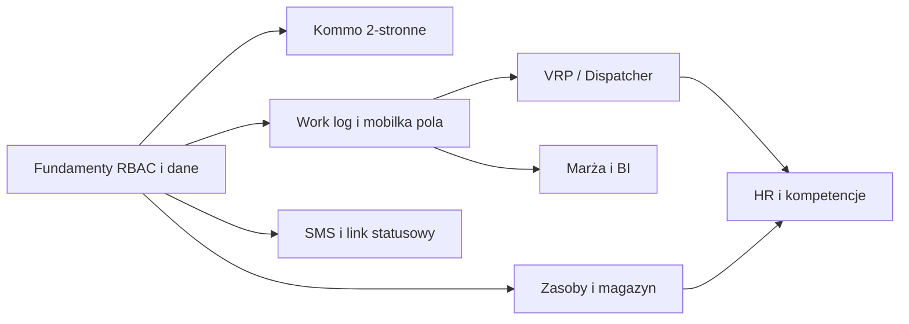

# ARBOR-OS — pełny zakres z Executive Summary → backlog realizacji

**Cel:** mieć jedną listę prac, żeby **dowieźć cały opisany funkcjonal** etapami — bez zgadywania „co jeszcze zostało”.

**Zasada:** zadania oznaczone `[ ]` do odhaczania; kolejność w ramach epika ma sens techniczny (najpierw dane/API, potem UI).

---

## Zależności między epikami (skrót)

---

## EPIC 0 — Fundamenty produktowe (wszystkie moduły na tym stoją)

- [ ] **0.1** Jedna „prawda” środowiskowa: `.env.example` + dokumentacja dla `os`, `web`, `mobile` (API URL, Kommo, mapy, SMS).
- [ ] **0.2** RBAC spójny: Dyrektor Produkcji / Kierownik Oddziału / Brygadzista — mapowanie ról w JWT, guardy na endpointach, ukrywanie akcji w UI.
- [ ] **0.3** Model `oddzial_id` konsekwentnie na zleceniach, ekipach, raportach (filtry BI).
- [ ] **0.4** Audyt: kto zmienił status zlecenia / dane finansowe (tabela + UI minimalny).
- [ ] **0.5** SLO: logi, metryki czasu API, alert na 5xx (nawet prosty).

---

## EPIC 1 — AI Dispatcher (VRP, okna, kompetencje, sprzęt, auto-dispatch)

- [ ] **1.1** Model danych: okno czasowe klienta, czas obsługi zlecenia, priorytet, wymagany sprzęt, wymagane kompetencje (schemat + migracja).
- [ ] **1.2** Decyzja architektoniczna: **Google Routes / Mapbox Optimization** vs **OR-Tools** self-hosted — dokument + szacunek kosztu API.
- [ ] **1.3** Serwis `POST /api/dispatch/plan` (wejście: zestaw zleceń + ekipy + dzień; wyjście: przypisania + kolejność + ETA).
- [ ] **1.4** Ograniczenia: okna czasowe, przerwy, max godzin prowadzenia, niedostępność pojazdu.
- [ ] **1.5** Ograniczenia kompetencji i sprzętu w solverze (filtrowanie ekip przed VRP).
- [ ] **1.6** UI Kierownika: „Auto-dispatch” + podgląd mapy + ręczna edycja (zapis planu).
- [ ] **1.7** Benchmark: N zleceń × M ekip w czasie z Executive Summary (<30 s dla 50×10 — parametr konfigurowalny).
- [ ] **1.8** Obsługa błędu solvera (brak rozwiązania → komunikat + propozycja ręczna).

---

## EPIC 2 — Aplikacja mobilna brygadzisty

- [ ] **2.1** START / STOP powiązane z `work_logs` + GPS (zgodność z `os` — już częściowo; dopracować edge cases).
- [ ] **2.2** Przycisk PROBLEM: typ zgłoszenia, zdjęcie, notatka, powiadomienie do kierownika.
- [ ] **2.3** Wymuszone zdjęcia „Przed / Po” (blokada zakończenia bez zdjęć — reguła konfigurowalna per oddział).
- [ ] **2.4** Raport zużycia (paliwo / materiał — pola + sync).
- [ ] **2.5** Offline-first **v2**: lokalna kolejka + **idempotency-key** na serwerze + rozstrzyganie konfliktów po sync.
- [ ] **2.6** Pobranie listy dzisiejszych zleceń offline (cache + TTL).
- [ ] **2.7** Testy na słabej sieci / airplane mode (checklist QA).

---

## EPIC 3 — Panel Kierownika Oddziału

- [ ] **3.1** Kalendarz zasobów (ekipy + krytyczny sprzęt) — jeden widok tygodnia.
- [ ] **3.2** Drag & drop przeniesienia zlecenia między slotami (zapis do API + walidacja kolizji).
- [ ] **3.3** Mapa planistyczna: pinezki zleceń + pozycje ekip (live gdzie dostępne).
- [ ] **3.4** Karty sprzętu: przegląd, ubezpieczenie, alerty (powiązanie z EPIC 6).
- [ ] **3.5** Integracja z wynikiem dispatchera (wczytanie planu dnia).

---

## EPIC 4 — Panel Dyrektorski / BI

- [ ] **4.1** Dashboard 6 oddziałów: KPI + kolory rentowności (progi konfigurowalne).
- [ ] **4.2** Plan vs real: godziny, trasy, koszt materiałów (źródła danych z work logów i magazynu).
- [ ] **4.3** Rankingi ekip / oddziałów (okres, metryka).
- [ ] **4.4** Alerty (marża, przeterminowane przeglądy, brak kompetencji).
- [ ] **4.5** Drill-down do pojedynczego zlecenia z BI.

---

## EPIC 5 — Komunikacja z klientem

- [ ] **5.1** Szablony SMS w cyklu życia zlecenia (konfiguracja per status).
- [ ] **5.2** Okna czasowe klienta (propozycja + akceptacja / odrzucenie).
- [ ] **5.3** Link statusowy: token, mapa, historia statusów (publiczny endpoint + RODO).
- [ ] **5.4** Śledzenie dostarczenia SMS (provider webhook / status).

---

## EPIC 6 — Zarządzanie zasobami

- [ ] **6.1** Karty maszyn: pełny CRUD + przypisanie do ekipy / oddziału.
- [ ] **6.2** Przeglądy, ubezpieczenia, motogodziny — przypomnienia i blokada użycia po terminie (reguła).
- [ ] **6.3** Magazyn materiałów eksploatacyjnych: stany, przyjęcia, rozchód na zlecenie.
- [ ] **6.4** Integracja z raportem zużycia z mobilki (EPIC 2).

---

## EPIC 7 — HR / kadry

- [ ] **7.1** Automatyczna ewidencja czasu pracy z work logów (reguły nadgodzin — prawnie zweryfikować).
- [ ] **7.2** Monitoring ważności uprawnień (karty pracownika).
- [ ] **7.3** Blokada przypisania do zlecenia bez wymaganych kompetencji (API + UI).
- [ ] **7.4** Integracja z dispatcherm: EPIC 1.5 + EPIC 7.3 muszą być spójne.

---

## EPIC 8 — Kommo dwukierunkowo (produkt „jak w spec”)

- [ ] **8.1** Kommo → ARBOR: mapowanie pól (adres, geokodowanie, zakres, wartość, załączniki) przy statusie „Do realizacji”.
- [ ] **8.2** ARBOR → Kommo: status, zdjęcia, czas rzeczywisty, zużycie, kosztorys z marżą, link statusowy.
- [ ] **8.3** Idempotencja webhooków, kolejka retry, dead-letter.
- [ ] **8.4** Panel diagnostyczny sync (ostatni błąd, HTTP, payload — częściowo już w DB przy push).

---

## EPIC 9 — Wymagania niefunkcjonalne (Executive §6)

- [ ] **9.1** Test wydajności panelu (<3 s TTI na referencyjnym sprzęcie — zdefiniować).
- [ ] **9.2** Test API p95 (<500 ms na krytycznych listach — zdefiniować zestaw).
- [ ] **9.3** Strategia backupów RPO/RTO (procedura + infrastruktura).
- [ ] **9.4** Skalowanie horyzontalne (sesje, uploady, worker dispatch).

---

## Jak „dowozić całość” w praktyce

1. **Ustalcie priorytet pierwszego epika** (zwykle 0 + 8.1–8.2 + 2.1–2.3 + 3.1).
2. **Każde zadanie = 1 PR** (mały, reviewowalny).
3. Co sprint: aktualizujcie ten plik (checkboxy) albo przenieście do Linear/Jira z linkiem „`docs/ARBOR-full-scope-implementation-backlog.md` §X.Y”.

---

## Realistyczna ramka czasowa (przypomnienie)

| Zakres | Kto | Rząd wielkości |
|--------|-----|----------------|
| Same checkboxy w tym dokumencie | Zespół 2–4 dev | **8+ miesięcy** przy równoległym EPIC 0–2 |
| Pełne 1–7 + Kommo + NFR | Zespół + PM + QA + DevOps | Zgodnie z Executive Summary (etapy 1–4) |

To nie jest ograniczenie „chęci”, tylko **objętości pracy i ryzyk integracyjnych** (Kommo, mapy, SMS, prawo pracy).

---

*Ostatnia aktualizacja: generowane jako punkt wyjścia — edytujcie checkboxy w repo lub migrujcie do narzędzia PM.*
