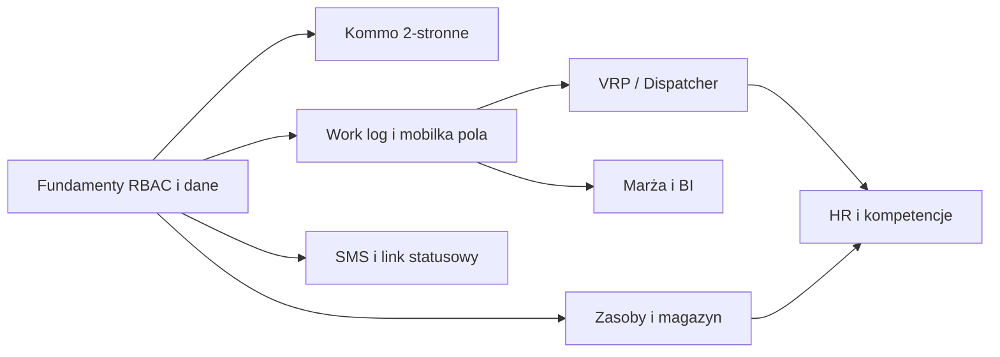

# ARBOR-OS — pełny zakres z Executive Summary → backlog realizacji

**Cel:** mieć jedną listę prac, żeby **dowieźć cały opisany funkcjonal** etapami — bez zgadywania „co jeszcze zostało”.

**Zasada:** zadania oznaczone `[ ]` do odhaczania; kolejność w ramach epika ma sens techniczny (najpierw dane/API, potem UI).

---

## Status techniczny po smoke 2026-05-28

- [x] **P0 smoke web**: 46 tras web przechodzi w trybie testowym bez przekierowania do logowania, bez pustych widokow, bez poziomego overflow i bez bledow konsoli/sieci >=400.
- [x] **P0 test/demo API**: nieznane endpointy w test-mode dostaja bezpieczny mock fallback zamiast uderzac w realny backend.
- [x] **P0 auth guard**: `401` nie kasuje sesji, gdy aktywny jest test-mode.
- [x] **P0 SSE**: real-time notifications sa wylaczone w test-mode, zeby demo/offline smoke nie generowal `/auth/me` i `/notifications/stream`.
- [x] **P0 backend critical path smoke**: endpoint-level test dla sciezki Kommo payload -> dispatcher -> START -> finish -> rozliczenie -> Kommo payload po zamknieciu.
- [x] **P0 Kommo settlement field**: `task.sync` niesie `wartosc_netto_do_rozliczenia` i `marza_pct`, zeby CRM mogl dostac wynik po zamknieciu zlecenia.
- [x] **P0 quotation approval in path**: critical-path smoke obejmuje zatwierdzenie wyceny (`quotations/:id/approvals/:aid/decision`) przed planowaniem i realizacja.
- [x] **P0 Kommo cost snapshot**: `task.sync` niesie `financials`, `settlement` oraz `material_usage` z rozliczenia i zuzycia po finish.
- [x] **P0 wspolny silnik marzy**: `taskMargin` liczy przychod netto, koszty robocizny/sprzetu/paliwa/materialow/utylizacji/inne, marze brutto i `margin_pct`.
- [x] **P0 spiete finansy**: Kommo payload, `/raporty/mobile` i operational digest korzystaja z tego samego liczenia marzy.
- [x] **P0 BI drill-down marzy**: `/api/bi/drill` zwraca per zlecenie `financials`, `cost_sources`, brakujace pola kosztowe i note skad wziela sie liczba.
- [x] **P0 UI drill-down marzy**: modal BI pokazuje przychod, znany koszt, marze i rozbicie zrodel kosztu z oznaczeniem OK / brak pola.
- [x] **P0 pola kosztow operacyjnych**: migracja dodaje koszt materialow przy finish oraz `task_operational_costs` dla sprzetu, paliwa, utylizacji i innych kosztow.
- [x] **P0 koszty operacyjne w marzy**: finish moze zapisac `koszty_operacyjne`, a BI/Kommo sumuja je do `taskMargin`.
- [x] **P0 finish UI kosztow**: web i mobile finish maja szybkie pola kosztow materialow, sprzetu, paliwa, utylizacji i innych kosztow.
- [x] **P0 finish payload kosztow**: web/mobile wysylaja `zuzyte_materialy[].koszt_laczny` oraz `koszty_operacyjne[]` zgodnie z backendem.
- [x] **P0 walidacja kosztow finish**: backend odrzuca ujemne, nieznane i nienaturalnie wysokie koszty materialow oraz kosztow operacyjnych.
- [x] **P0 sugestie stawek finish per oddzial**: `/api/tasks/:id/finish-cost-suggestions` zwraca podpowiedzi sprzet/paliwo/utylizacja z konfiguracji oddzialu i rezerwacji sprzetu.
- [x] **P0 finish UI sugestii kosztow**: web i mobile pobieraja sugestie stawek oddzialu i pozwalaja jednym kliknieciem wpisac je do kosztow operacyjnych.
- [x] **P0 alerty marzy BI/digest**: BI alerts i poranny digest wykrywaja zlecenia ponizej `branches.marza_prog_rentowosci_pct`, liczac wspolnym silnikiem marzy i realnymi kosztami finish.
- [x] **P0 UI alertow marzy w BI**: karta alertow BI pokazuje liste zlecen z marza ponizej progu oddzialu.
- [x] **P0 alerty marzy w kokpicie kierownika**: `/api/ops/kierownik-today` zwraca `margin_risks`, metryke i blocker `margin`, a webowy cockpit pokazuje liste z linkiem do zlecenia.
- [x] **P0 Kommo retry/dead-letter**: `task.sync` zapisuje nieudane wysylki do kolejki, przechodzi do `dead_letter` po limicie prob i ma endpoint recznego retry.
- [x] **P0 Kommo inbound status sync**: `/api/webhooks/kommo/task-sync` przyjmuje status z Kommo, ma idempotencje eventow i blokuje konflikty na zamknietych zleceniach.
- [x] **P0 Kommo sync diagnostyka**: `/api/tasks/kommo-sync/diagnostics` oraz panel Integracje pokazuja outbound queue, dead-letter i inbound konflikty.
- [x] **P0 Kommo inbound field mapping**: `task.sync` mapuje `status_id`, klienta, telefon, email, adres, miasto, zakres, wartosc, priorytet, termin, oddzial, ekipe, pinezke i linki zalacznikow do notatek.
- [x] **P0 Dispatcher diagnostics**: solver nie przypisuje zlecen lamiacych pojedyncze okno/capacity, a `unassigned` zwraca etykiety i szczegoly brakow sprzetu, kompetencji, okien oraz pojemnosci.
- [ ] **Nastepny pakiet**: rozbudowac Kommo -> ARBOR o pobieranie zalacznikow jako pliki oraz ekran konfiguracji mapowania pol/statusow pod konkretne konto Kommo.

---

## Zależności między epikami (skrót)

---

## EPIC 0 — Fundamenty produktowe (wszystkie moduły na tym stoją)

- [ ] **0.1** Jedna „prawda” środowiskowa: `.env.example` + dokumentacja dla `os`, `web`, `mobile` (API URL, Kommo, mapy, SMS).
- [ ] **0.2** RBAC spójny: Dyrektor Produkcji / Kierownik Oddziału / Brygadzista — mapowanie ról w JWT, guardy na endpointach, ukrywanie akcji w UI.
- [ ] **0.3** Model `oddzial_id` konsekwentnie na zleceniach, ekipach, raportach (filtry BI).
- [ ] **0.4** Audyt: kto zmienił status zlecenia / dane finansowe (tabela + UI minimalny).
- [ ] **0.5** SLO: logi, metryki czasu API, alert na 5xx (nawet prosty).

---

## EPIC 1 — AI Dispatcher (VRP, okna, kompetencje, sprzęt, auto-dispatch)

- [x] **1.1** Model danych: okno czasowe klienta, czas obslugi zlecenia, priorytet, wymagany sprzet, wymagane kompetencje (schemat + migracja).
- [ ] **1.2** Decyzja architektoniczna: **Google Routes / Mapbox Optimization** vs **OR-Tools** self-hosted — dokument + szacunek kosztu API.
- [x] **1.3** Serwis `POST /api/dispatch/plan` (wejscie: zestaw zlecen + ekipy + dzien; wyjscie: przypisania + kolejnosc + ETA).
- [ ] **1.4** Ograniczenia: okna czasowe, przerwy, max godzin prowadzenia, niedostepnosc pojazdu. **Czesciowo:** okna, max godzin i nieobecnosc ekip sa respektowane; zostaja przerwy i twarda niedostepnosc pojazdu w planie.
- [x] **1.5** Ograniczenia kompetencji i sprzetu w solverze (filtrowanie ekip przed VRP).
- [x] **1.6** UI Kierownika: Auto-dispatch + podglad mapy + reczna edycja (zapis planu).
- [x] **1.7** Benchmark: wynik planu zwraca `solver_target_ms` i `solver_sla_ok` z konfigurowalnym `DISPATCH_SOLVER_TARGET_MS`.
- [x] **1.8** Obsluga bledu/braku rozwiazania: `unassigned` zwraca reason, etykiete i szczegoly dla no_teams/no_capable_team/time_window_missed/capacity_exceeded.

---

## EPIC 2 — Aplikacja mobilna brygadzisty

- [ ] **2.1** START / STOP powiązane z `work_logs` + GPS (zgodność z `os` — już częściowo; dopracować edge cases).
- [ ] **2.2** Przycisk PROBLEM: typ zgłoszenia, zdjęcie, notatka, powiadomienie do kierownika.
- [ ] **2.3** Wymuszone zdjęcia „Przed / Po” (blokada zakończenia bez zdjęć — reguła konfigurowalna per oddział).
- [ ] **2.4** Raport zużycia (paliwo / materiał — pola + sync).
- [ ] **2.5** Offline-first **v2**: lokalna kolejka + **idempotency-key** na serwerze + rozstrzyganie konfliktów po sync.
- [ ] **2.6** Pobranie listy dzisiejszych zleceń offline (cache + TTL).
- [ ] **2.7** Testy na słabej sieci / airplane mode (checklist QA).

---

## EPIC 3 — Panel Kierownika Oddziału

- [ ] **3.1** Kalendarz zasobów (ekipy + krytyczny sprzęt) — jeden widok tygodnia.
- [ ] **3.2** Drag & drop przeniesienia zlecenia między slotami (zapis do API + walidacja kolizji).
- [ ] **3.3** Mapa planistyczna: pinezki zleceń + pozycje ekip (live gdzie dostępne).
- [ ] **3.4** Karty sprzętu: przegląd, ubezpieczenie, alerty (powiązanie z EPIC 6).
- [ ] **3.5** Integracja z wynikiem dispatchera (wczytanie planu dnia).

---

## EPIC 4 — Panel Dyrektorski / BI

- [ ] **4.1** Dashboard 6 oddziałów: KPI + kolory rentowności (progi konfigurowalne).
- [ ] **4.2** Plan vs real: godziny, trasy, koszt materiałów (źródła danych z work logów i magazynu).
- [ ] **4.3** Rankingi ekip / oddziałów (okres, metryka).
- [ ] **4.4** Alerty (marża, przeterminowane przeglądy, brak kompetencji).
- [ ] **4.5** Drill-down do pojedynczego zlecenia z BI.

---

## EPIC 5 — Komunikacja z klientem

- [ ] **5.1** Szablony SMS w cyklu życia zlecenia (konfiguracja per status).
- [ ] **5.2** Okna czasowe klienta (propozycja + akceptacja / odrzucenie).
- [ ] **5.3** Link statusowy: token, mapa, historia statusów (publiczny endpoint + RODO).
- [ ] **5.4** Śledzenie dostarczenia SMS (provider webhook / status).

---

## EPIC 6 — Zarządzanie zasobami

- [ ] **6.1** Karty maszyn: pełny CRUD + przypisanie do ekipy / oddziału.
- [ ] **6.2** Przeglądy, ubezpieczenia, motogodziny — przypomnienia i blokada użycia po terminie (reguła).
- [ ] **6.3** Magazyn materiałów eksploatacyjnych: stany, przyjęcia, rozchód na zlecenie.
- [ ] **6.4** Integracja z raportem zużycia z mobilki (EPIC 2).

---

## EPIC 7 — HR / kadry

- [ ] **7.1** Automatyczna ewidencja czasu pracy z work logów (reguły nadgodzin — prawnie zweryfikować).
- [ ] **7.2** Monitoring ważności uprawnień (karty pracownika).
- [ ] **7.3** Blokada przypisania do zlecenia bez wymaganych kompetencji (API + UI).
- [ ] **7.4** Integracja z dispatcherm: EPIC 1.5 + EPIC 7.3 muszą być spójne.

---

## EPIC 8 — Kommo dwukierunkowo (produkt „jak w spec”)

- [ ] **8.1** Kommo -> ARBOR: mapowanie pol (adres, geokodowanie, zakres, wartosc, zalaczniki) przy statusie "Do realizacji". **Czesciowo:** inbound `task.sync` obsluguje status/status_id, klienta, adres, miasto, zakres, wartosc, priorytet, termin, oddzial, ekipe, pinezke i linki zalacznikow w notatce. Zostaje import zalacznikow jako pliki i konfigurowalne mapowanie przez UI.
- [ ] **8.2** ARBOR → Kommo: status, zdjęcia, czas rzeczywisty, zużycie, kosztorys z marżą, link statusowy.
- [ ] **8.3** Idempotencja webhookow, kolejka retry, dead-letter. **Czesciowo:** ARBOR -> Kommo `task.sync` ma juz retry/dead-letter, a Kommo -> ARBOR ma idempotencje eventow.
- [x] **8.4** Panel diagnostyczny sync (ostatni blad, HTTP, payload): API diagnostyczne + panel Integracje dla kolejki outbound i inbound konfliktow.

---

## EPIC 9 — Wymagania niefunkcjonalne (Executive §6)

- [ ] **9.1** Test wydajności panelu (<3 s TTI na referencyjnym sprzęcie — zdefiniować).
- [ ] **9.2** Test API p95 (<500 ms na krytycznych listach — zdefiniować zestaw).
- [ ] **9.3** Strategia backupów RPO/RTO (procedura + infrastruktura).
- [ ] **9.4** Skalowanie horyzontalne (sesje, uploady, worker dispatch).

---

## Jak „dowozić całość” w praktyce

1. **Ustalcie priorytet pierwszego epika** (zwykle 0 + 8.1–8.2 + 2.1–2.3 + 3.1).
2. **Każde zadanie = 1 PR** (mały, reviewowalny).
3. Co sprint: aktualizujcie ten plik (checkboxy) albo przenieście do Linear/Jira z linkiem „`docs/ARBOR-full-scope-implementation-backlog.md` §X.Y”.

---

## Realistyczna ramka czasowa (przypomnienie)

| Zakres | Kto | Rząd wielkości |
|--------|-----|----------------|
| Same checkboxy w tym dokumencie | Zespół 2–4 dev | **8+ miesięcy** przy równoległym EPIC 0–2 |
| Pełne 1–7 + Kommo + NFR | Zespół + PM + QA + DevOps | Zgodnie z Executive Summary (etapy 1–4) |

To nie jest ograniczenie „chęci”, tylko **objętości pracy i ryzyk integracyjnych** (Kommo, mapy, SMS, prawo pracy).

---

*Ostatnia aktualizacja: generowane jako punkt wyjścia — edytujcie checkboxy w repo lub migrujcie do narzędzia PM.*
