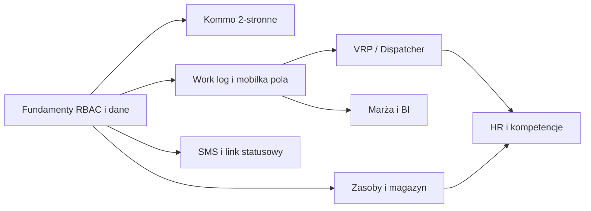

# ARBOR-OS — pełny zakres z Executive Summary → backlog realizacji

**Cel:** mieć jedną listę prac, żeby **dowieźć cały opisany funkcjonal** etapami — bez zgadywania „co jeszcze zostało”.

**Zasada:** zadania oznaczone `[ ]` do odhaczania; kolejność w ramach epika ma sens techniczny (najpierw dane/API, potem UI).

---

## Status techniczny po smoke 2026-05-28

- [x] **P0 smoke web**: 46 tras web przechodzi w trybie testowym bez przekierowania do logowania, bez pustych widokow, bez poziomego overflow i bez bledow konsoli/sieci >=400.
- [x] **P0 test/demo API**: nieznane endpointy w test-mode dostaja bezpieczny mock fallback zamiast uderzac w realny backend.
- [x] **P0 auth guard**: `401` nie kasuje sesji, gdy aktywny jest test-mode.
- [x] **P0 SSE**: real-time notifications sa wylaczone w test-mode, zeby demo/offline smoke nie generowal `/auth/me` i `/notifications/stream`.
- [x] **P0 backend critical path smoke**: endpoint-level test dla sciezki Kommo payload -> dispatcher -> START -> finish -> rozliczenie -> Kommo payload po zamknieciu.
- [x] **P0 Kommo settlement field**: `task.sync` niesie `wartosc_netto_do_rozliczenia` i `marza_pct`, zeby CRM mogl dostac wynik po zamknieciu zlecenia.
- [x] **P0 quotation approval in path**: critical-path smoke obejmuje zatwierdzenie wyceny (`quotations/:id/approvals/:aid/decision`) przed planowaniem i realizacja.
- [x] **P0 Kommo cost snapshot**: `task.sync` niesie `financials`, `settlement` oraz `material_usage` z rozliczenia i zuzycia po finish.
- [x] **P0 wspolny silnik marzy**: `taskMargin` liczy przychod netto, koszty robocizny/sprzetu/paliwa/materialow/utylizacji/inne, marze brutto i `margin_pct`.
- [x] **P0 spiete finansy**: Kommo payload, `/raporty/mobile` i operational digest korzystaja z tego samego liczenia marzy.
- [x] **P0 BI drill-down marzy**: `/api/bi/drill` zwraca per zlecenie `financials`, `cost_sources`, brakujace pola kosztowe i note skad wziela sie liczba.
- [x] **P0 UI drill-down marzy**: modal BI pokazuje przychod, znany koszt, marze i rozbicie zrodel kosztu z oznaczeniem OK / brak pola.
- [x] **P0 pola kosztow operacyjnych**: migracja dodaje koszt materialow przy finish oraz `task_operational_costs` dla sprzetu, paliwa, utylizacji i innych kosztow.
- [x] **P0 koszty operacyjne w marzy**: finish moze zapisac `koszty_operacyjne`, a BI/Kommo sumuja je do `taskMargin`.
- [x] **P0 finish UI kosztow**: web i mobile finish maja szybkie pola kosztow materialow, sprzetu, paliwa, utylizacji i innych kosztow.
- [x] **P0 finish payload kosztow**: web/mobile wysylaja `zuzyte_materialy[].koszt_laczny` oraz `koszty_operacyjne[]` zgodnie z backendem.
- [x] **P0 walidacja kosztow finish**: backend odrzuca ujemne, nieznane i nienaturalnie wysokie koszty materialow oraz kosztow operacyjnych.
- [x] **P0 sugestie stawek finish per oddzial**: `/api/tasks/:id/finish-cost-suggestions` zwraca podpowiedzi sprzet/paliwo/utylizacja z konfiguracji oddzialu i rezerwacji sprzetu.
- [x] **P0 finish UI sugestii kosztow**: web i mobile pobieraja sugestie stawek oddzialu i pozwalaja jednym kliknieciem wpisac je do kosztow operacyjnych.
- [x] **P0 alerty marzy BI/digest**: BI alerts i poranny digest wykrywaja zlecenia ponizej `branches.marza_prog_rentowosci_pct`, liczac wspolnym silnikiem marzy i realnymi kosztami finish.
- [x] **P0 UI alertow marzy w BI**: karta alertow BI pokazuje liste zlecen z marza ponizej progu oddzialu.
- [x] **P0 alerty marzy w kokpicie kierownika**: `/api/ops/kierownik-today` zwraca `margin_risks`, metryke i blocker `margin`, a webowy cockpit pokazuje liste z linkiem do zlecenia.
- [x] **P0 Kommo retry/dead-letter**: `task.sync` zapisuje nieudane wysylki do kolejki, przechodzi do `dead_letter` po limicie prob i ma endpoint recznego retry.
- [x] **P0 Kommo inbound status sync**: `/api/webhooks/kommo/task-sync` przyjmuje status z Kommo, ma idempotencje eventow i blokuje konflikty na zamknietych zleceniach.
- [x] **P0 Kommo sync diagnostyka**: `/api/tasks/kommo-sync/diagnostics` oraz panel Integracje pokazuja outbound queue, dead-letter i inbound konflikty.
- [x] **P0 Kommo inbound field mapping**: `task.sync` mapuje `status_id`, klienta, telefon, email, adres, miasto, zakres, wartosc, priorytet, termin, oddzial, ekipe, pinezke i linki zalacznikow do notatek.
- [x] **P0 Kommo attachments as documents**: inbound `task.sync` zapisuje zalaczniki Kommo jako `task_documents`, a `/api/tasks/:id/dokumenty` obsluguje liste, upload, edycje, wersjonowanie i usuwanie dokumentow zlecenia.
- [x] **P0 Dispatcher diagnostics**: solver nie przypisuje zlecen lamiacych pojedyncze okno/capacity, a `unassigned` zwraca etykiety i szczegoly brakow sprzetu, kompetencji, okien oraz pojemnosci.
- [x] **P0 Kommo configurable mapping UI**: `/api/kommo/config` zapisuje mapowania statusow i aliasow pol per `account_key`; panel Integracje ma edytor JSON, a inbound `task.sync` uzywa zapisanej konfiguracji.
- [x] **P0 Kommo attachment binary copy**: opcja `copy_attachment_binaries_to_storage` pobiera zalacznik z Kommo, zapisuje kopie w upload storage ARBOR i zachowuje `remote_url` jako zrodlo.
- [x] **P0 Kommo outbound operational package**: `task.sync` ARBOR -> Kommo dolacza status URL, work logi, realny czas, zdjecia, dokumenty, materialy, koszty i marze.
- [x] **P0 publiczny link statusowy klienta**: `/track/:token` wymaga prywatnego tokena, pokazuje bezpieczny zakres danych, mape, oddzialowy kontakt i historie statusow; `/api/tasks/:id/status-link` generuje link.
- [x] **P0 szablony SMS per status/oddzial**: `/api/sms/templates` pozwala listowac i zapisywac szablony per status oraz oddzial, wysylka zlecenia uzywa konfiguracji oddzialowej z fallbackiem globalnym/default i podstawia publiczny link statusowy.
- [x] **P0 sledzenie dostarczenia SMS Zadarma**: `/api/sms/webhooks/zadarma` i `/zadarma/status` zapisuja provider status, bledy, czas dostawy oraz audyt `sms_delivery_events`; widok Telefonia pokazuje dostarczone/bledy dostawy i status providera.
- [x] **P0 instrukcja env Zadarma SMS webhook**: `os/.env.example` opisuje publiczny URL `/api/sms/webhooks/zadarma`, wlaczenie SMS webhook notifications w panelu Zadarma i alias `/zadarma/status`.
- [x] **P0 okna czasowe klienta**: backoffice tworzy propozycje z publicznym tokenem, klient akceptuje/odrzuca okno, akceptacja zapisuje `okno_od`/`okno_do`, a planowanie biurowe i DnD blokuje terminy poza zaakceptowanym oknem.
- [x] **P0 jedna prawda srodowiskowa**: `docs/ENVIRONMENT-RUNBOOK.md` opisuje lokalne/prod env dla `os`, `web`, `mobile`, Kommo, Zadarma i publicznych linkow; szablony deploy maja `PUBLIC_BASE_URL`/Zadarma, a `npm run verify:env-runbook` pilnuje krytycznych zmiennych.
- [x] **P0 UI/SMS okien czasowych klienta**: plan biura w `Zlecenia` tworzy propozycje okna, wysyla SMS z linkiem przez Zadarma/SMS gateway z szablonu `time_window_proposal` i pozwala skopiowac publiczny link.
- [x] **P0 historia/diagnostyka okien czasowych**: `/api/tasks/:id/time-window-proposals` zwraca ostatnie propozycje z linkiem, statusem decyzji klienta, wygasnieciem i diagnostyka SMS z `sms_history`; panel `Zlecenia` pokazuje historie i pozwala kopiowac poprzednie linki.
- [x] **P0 raport ryzyk dnia kierownika**: `/api/ops/kierownik-today` zwraca `risk_report` z oknami klienta, ryzykami Zadarma/SMS, konfliktami ekip/sprzetu i marza ponizej progu; kokpit kierownika pokazuje liczniki, liste ryzyk i pozwala skopiowac raport tekstowy.
- [x] **P0 akcje z raportu ryzyk dnia**: `/api/ops/risk-report/actions` ponawia SMS przez Zadarma-first gateway, kolejkuje/uruchamia telefon Zadarma i zapisuje decyzje w `ops_action_events`; kokpit kierownika ma przyciski `Zadarma SMS` i `Zadarma tel.` przy ryzykach.
- [x] **P0 przepiecie ekipy/sprzetu z ryzyka konfliktu**: `/api/ops/risk-report/actions/options` proponuje bezkolizyjna ekipe albo alternatywny sprzet, a `reassign_team`/`replace_equipment` stosuja zmiane, aktualizuja rezerwacje/notatki i zapisuja audyt decyzji kierownika.
- [x] **P0 historia decyzji operacyjnych kierownika**: `/api/ops/action-history` zwraca filtrowalna historie `ops_action_events` po dacie, oddziale, typie decyzji, ryzyku, zleceniu i wyszukiwaniu; kokpit kierownika pokazuje panel historii z wynikiem decyzji, aktorem i przejsciem do zlecenia.
- [x] **P0 eksport i kontrola decyzji operacyjnych dyrektora**: `/api/ops/action-history?format=csv` eksportuje rejestr decyzji do CSV, a web ma widok `/kontrola-operacyjna` dla Dyrektora/Prezesa/Admina z filtrami, KPI, drukiem/PDF i eksportem decyzji Zadarma/ryzyk.
- [x] **P0 dzienny digest kontroli operacyjnej**: `opsDigest` dolacza pamiec decyzji operacyjnych z `ops_action_events`, liczniki Zadarma/SMS, przepiecia ryzyk i ostatnie akcje; widok `/kontrola-operacyjna` ma podglad digestu dyrektora z alertami oraz KPI.
- [x] **P0 historia uruchomien digestu operacyjnego**: `operational_digest_runs` zapisuje globalne i oddzialowe uruchomienia digestu z triggerem, aktorem, licznikami alertow, odbiorcami, emailami i bledami; `/api/automations/daily-digest/history` udostepnia historie, a kontrola operacyjna pokazuje ostatnie wysylki.
- [x] **P0 konfiguracja odbiorcow i cron digestu**: `operational_digest_settings` zapisuje wlaczenie, godzine, email, horyzont, odbiorcow i dodatkowe adresy per global/oddzial; `/api/automations/daily-digest/settings` zarzadza konfiguracja, `/daily-digest/tick?secret=OPS_CRON_SECRET` uruchamia cron z `respectEnabled`, a kontrola operacyjna ma formularz ustawien.
- [x] **Smoke demo mode E2E**: frontendowy tryb testowy ma stabilny smoke dla sciezki Zadarma phone-only -> Kommo payload -> dispatcher -> start/finish -> rozliczenie -> marza -> BI/drill.
- [x] **Kontrola brakow po smoke w demo mode**: smoke E2E sprawdza Kommo diagnostics/config, blokady i rekomendacje dispatchera oraz BI drill z `cost_sources` dla zlecenia po rozliczeniu.
- [x] **Backendowy kontrakt apply rekomendacji**: `/api/ops/action-recommendations/:id/apply` wykonuje `set_duration_batch`, `remind_team_batch` albo zwraca nawigacje dla `open_*`, zapisuje feedback `accepted/source=action`, a UI kierownika korzysta z jednego kontraktu.
- [x] **Dispatch preflight z rekomendacji**: `fix_dispatch_blockers` w `/api/ops/action-recommendations/:id/apply` automatycznie dobiera wolna ekipe, dopisuje checklist GPS pod prace przez Zadarma i zwraca `dispatch_preflight` z tym, co gotowe oraz co nadal blokuje plan.
- [x] **P0 dokument QA pilota 1 oddzialu**: `docs/PILOT-ONE-BRANCH-CHECKLIST.md` spina bramke wejscia, dane startowe, scenariusz A-Z, offline, BI, klienta, smoke i GO/NO-GO.
- [x] **P0 dispatch preflight w Auto-dispatch/Harmonogram**: Auto-dispatch zatrzymuje zapis na blokadach, uruchamia `fix_dispatch_blockers`, pokazuje wynik naprawy i nadal pozwala na swiadomy bypass; Harmonogram ma wejscie do preflightu dla wybranego dnia.
- [x] **P0 mobile/offline v2 dla pilota**: mobilka cache'uje dzisiejsze zlecenia i szczegoly, lista pokazuje status kolejki offline, a flush rozroznia bezpieczny konflikt `TASK_ALREADY_FINISHED` od `IDEMPOTENCY_INCOMPLETE`, ktory zostaje w retry.
- [x] **P0 RBAC/audyt pilota**: BI drill redaguje finanse dla rol operacyjnych, SMS manualny/szablonowy respektuje role i oddzial, a Kommo push/retry/payload wymaga roli biurowej; testy pokrywaja krytyczne blokady finansow, SMS i Kommo, a istniejace access-policy pilnuje rozliczen/eksportow ekip.
- [x] **P0 audyt zmian statusu i danych finansowych**: `audit_log` obejmuje status manualny, finish z wartoscia netto oraz upsert rozliczenia finansowego z poprzednimi/nastepnymi wartosciami; `/api/audit` jest dostepne dla Dyrektora/Admina oraz branch-scoped dla Kierownika.
- [x] **P0 UI/role polish RBAC**: web ukrywa finansowe KPI/wartosci dla rol bez `canViewFinance`, chowa SMS i Kommo w szczegole zlecenia zgodnie z backendowa macierza oraz nie odpala automatycznego SMS przy zmianie statusu dla rol bez uprawnien; BI drill pokazuje operacyjne dane z komunikatem `Finanse ukryte`.
- [x] **P0 pilot hardening**: `docs/PILOT-HARDENING-KIEROWNIK-BRYGADZISTA.md` spina smoke Kierownik + Brygadzista na web/mobile, macierz GO/NO-GO i artefakty startu oddzialu; `npm run verify:pilot-hardening` pilnuje checklist, smoke scriptow i slow kluczowych.
- [x] **P0 production deploy dry-run**: `docs/PRODUCTION-DEPLOY-DRY-RUN.md` opisuje suchy przebieg env, migracji, admin bootstrap, backup/restore dry-run i smoke po publicznym URL; `npm run deploy:prod:dry-run` pilnuje skryptow, runbookow i komend GO/NO-GO.
- [x] **P0 SLO/observability minimum**: `docs/OBSERVABILITY-SLO-RUNBOOK.md` definiuje health/ready/metrics, progi 5xx/p95, storage smoke, DB pool i prosty alert P1/P2; `npm run verify:observability` pilnuje endpointow, metryk Prometheus i komend operacyjnych.
- [x] **P0 production incident runbook**: `docs/PRODUCTION-INCIDENT-RUNBOOK.md` opisuje pierwsze 30 minut reakcji na down API, wolne p95/5xx, storage fail, Kommo/SMS dead-letter i awaryjny restore; `npm run verify:incident-runbook` pilnuje scenariuszy, skryptow i guardow restore.
- [x] **P0 p95 smoke script**: `npm run smoke:p95 -- https://<arbor-os-url> --threshold 500 --samples 5` mierzy p95 bezpiecznych krytycznych endpointow po publicznym URL, rozszerza probe po tokenie/loginie i raportuje PASS/FAIL dla progu 500 ms.
- [x] **P0 Kommo/SMS incident drill**: `docs/KOMMO-SMS-INCIDENT-DRILL.md` opisuje kontrolowany test `dead_letter`, retry pojedynczego zlecenia, SMS delivery fail i fallback Zadarma; `npm run verify:kommo-sms-drill` pilnuje diagnostyki, guardow `force=true`, delivery events i UI Integracje/Telefonia/Kierownik.
- [x] **P0 backup RPO/RTO hardening**: `docs/BACKUP-RPO-RTO-RUNBOOK.md` definiuje mierzalne RPO/RTO, harmonogram backupow, restore drill na bazie replaceable, retencje i artefakty potwierdzenia; `npm run verify:backup-rpo` pilnuje runbookow, skryptow backup/restore i guardow `CONFIRM_RESTORE`.
- [x] **P0 web TTI smoke**: `docs/WEB-TTI-SMOKE-RUNBOOK.md` opisuje referencyjny pomiar panelu, prog TTI <= 3000 ms, trasy krytyczne i artefakt JSON; `npm run smoke:web:tti` mierzy render SPA przez Chrome/CDP, a `npm run verify:web-tti` pilnuje komend i runbooka.
- [x] **P0 horizontal scaling readiness**: `docs/HORIZONTAL-SCALING-READINESS.md` opisuje stateless JWT, wspolny `JWT_SECRET`, `UPLOAD_STORAGE=s3`, Redis login limiter, limity DB pool, pojedyncze crony/workery, SSE best-effort i dispatcher; `npm run verify:scale-readiness` pilnuje guardow i checklist.
- [x] **P0 RBAC branch scope audit**: `docs/RBAC-BRANCH-SCOPE-AUDIT.md` definiuje macierz Prezes/Dyrektor/Admin/Kierownik/Brygadzista, branch scope, team scope i finansowe NO-GO; `npm run verify:rbac-scope` pilnuje JWT, `oddzial_id`, `ekipa_id`, guardow backendu, BI redakcji finansow i web route guards.
- [x] **P0 dispatcher architecture decision**: `docs/DISPATCHER-ARCHITECTURE-DECISION.md` wybiera OR-Tools/self-hosted jako docelowy solver, zostawia `arbor-clarke-wright` jako fallback pilota, ogranicza Google/Mapbox do macierzy czasu/ETA i koszt API; `npm run verify:dispatcher-adr` pilnuje ADR, runtime `solver_engine`, limitow i checklist.
- [x] **P0 mobile problem/offline incident flow**: `docs/MOBILE-PROBLEM-OFFLINE-FLOW.md` opisuje PROBLEM z notatka/zdjeciem, pending offline, `queueTaskProblemOffline`, idempotentny flush, backendowe `notifications` dla kierownika i testy; `npm run verify:mobile-problem-flow` pilnuje kontraktu mobile/backend.
- [x] **P0 mobile before/after photo enforcement**: `docs/MOBILE-BEFORE-AFTER-PHOTO-ENFORCEMENT.md` opisuje konfigurowalna blokade finish bez zdjec Przed/Po, mobile respektuje `finish_requirements`, a backend egzekwuje globalne i per-oddzialowe `TASK_FINISH_REQUIRE_*_PHOTO_BRANCHES`; `npm run verify:mobile-before-after-photo` i `npm run verify:mobile-photo-enforcement` pilnuja kontraktu.
- [x] **P0 mobile material usage/offline cost flow**: `docs/MOBILE-MATERIAL-OFFLINE-COST-FLOW.md` spina raport zuzycia materialow, paliwa i utylizacji z mobile finish, pending offline, backend persistence, BI/Kommo i smoke; `npm run verify:mobile-material-cost-flow` pilnuje kontraktu.
- [x] **P0 mobile today's tasks offline cache**: `docs/MOBILE-TODAY-TASKS-OFFLINE-CACHE.md` opisuje cache listy dnia, TTL 18h, stale hint 15 min i recache po sync; `formatTaskListCacheNotice`, `loadTodayTaskListCache` i `npm run verify:mobile-today-cache` pilnuja flow w `zlecenia.tsx` oraz `misja-dnia.tsx`.
- [x] **P0 mobile offline conflict/idempotency coverage**: `docs/MOBILE-OFFLINE-CONFLICT-IDEMPOTENCY.md` opisuje START/check-in/STOP, zdjecia, PROBLEM i finish na slabej sieci; `queueTaskWorkSignalOffline`, dedupe zdjec, retry backoff, `TASK_ALREADY_FINISHED` i `IDEMPOTENCY_INCOMPLETE` sa pilnowane przez `npm run verify:mobile-offline-conflicts`.
- [x] **P0 mobile START/STOP work log edge cases**: `docs/MOBILE-START-STOP-WORKLOG-EDGE-CASES.md` opisuje aktywny work log, brak GPS, podwojny START/STOP, statusy i backend tests EPIC 2.1; `npm run verify:mobile-start-stop-edge` pilnuje kontraktu.
- [x] **P0 resource calendar weekly contract**: `docs/RESOURCE-CALENDAR-WEEKLY-CONTRACT.md` opisuje jeden tygodniowy widok ekip, krytycznego sprzetu i rezerwacji; `npm run verify:resource-calendar-week` pilnuje route, API, web testow i blokad kolizji.
- [ ] **Nastepny pakiet**: EPIC 3.2 - drag & drop przeniesienia zlecenia miedzy slotami z walidacja kolizji.

---

## Zależności między epikami (skrót)

---

## EPIC 0 — Fundamenty produktowe (wszystkie moduły na tym stoją)

- [x] **0.1** Jedna „prawda” środowiskowa: `.env.example` + dokumentacja dla `os`, `web`, `mobile` (API URL, Kommo, mapy, SMS). Dodano `docs/ENVIRONMENT-RUNBOOK.md`, poprawiono szablony web/mobile/deploy i checker `verify:env-runbook`.
- [x] **0.2** RBAC spójny: Dyrektor Produkcji / Kierownik Oddziału / Brygadzista — mapowanie ról w JWT, guardy na endpointach, ukrywanie akcji w UI. `docs/RBAC-BRANCH-SCOPE-AUDIT.md` + `verify:rbac-scope` pilnuja macierzy rol, web route guards i finansow.
- [x] **0.3** Model `oddzial_id` konsekwentnie na zleceniach, ekipach, raportach (filtry BI). `scopedOddzialId`, `getTaskScope`, BI branch filters i audit scope sa objete bramka `verify:rbac-scope`.
- [x] **0.4** Audyt: kto zmienił status zlecenia / dane finansowe (tabela + UI minimalny).
- [x] **0.5** SLO: logi, metryki czasu API, alert na 5xx (nawet prosty). Minimum operacyjne opisuje `docs/OBSERVABILITY-SLO-RUNBOOK.md`, a `verify:observability` pilnuje `/api/health`, `/api/ready`, `/api/metrics`, p95, 5xx i storage smoke.

---

## EPIC 1 — AI Dispatcher (VRP, okna, kompetencje, sprzęt, auto-dispatch)

- [x] **1.1** Model danych: okno czasowe klienta, czas obslugi zlecenia, priorytet, wymagany sprzet, wymagane kompetencje (schemat + migracja).
- [x] **1.2** Decyzja architektoniczna: **Google Routes / Mapbox Optimization** vs **OR-Tools** self-hosted. `docs/DISPATCHER-ARCHITECTURE-DECISION.md` wybiera OR-Tools/self-hosted + fallback `arbor-clarke-wright`; Google/Mapbox zostaja opcjonalna macierza czasu/ETA z quota i kosztem API, a `verify:dispatcher-adr` pilnuje decyzji.
- [x] **1.3** Serwis `POST /api/dispatch/plan` (wejscie: zestaw zlecen + ekipy + dzien; wyjscie: przypisania + kolejnosc + ETA).
- [x] **1.4** Ograniczenia: okna czasowe, przerwy, max godzin prowadzenia, niedostepnosc pojazdu/sprzetu. Solver respektuje okna, limity dnia, nieobecnosc ekip, przerwy (`przerwa_od`/`przerwa_do`) oraz wyklucza sprzet niedostepny statusem lub rezerwacja na inna ekipe.
- [x] **1.5** Ograniczenia kompetencji i sprzetu w solverze (filtrowanie ekip przed VRP).
- [x] **1.6** UI Kierownika: Auto-dispatch + podglad mapy + reczna edycja (zapis planu).
- [x] **1.7** Benchmark: wynik planu zwraca `solver_target_ms` i `solver_sla_ok` z konfigurowalnym `DISPATCH_SOLVER_TARGET_MS`.
- [x] **1.8** Obsluga bledu/braku rozwiazania: `unassigned` zwraca reason, etykiete i szczegoly dla no_teams/no_capable_team/time_window_missed/capacity_exceeded.

---

## EPIC 2 — Aplikacja mobilna brygadzisty

- [x] **2.1** START / STOP powiązane z `work_logs` + GPS. Backend odrzuca zamkniete zlecenie, drugi aktywny START, STOP bez GPS dla ekipy, STOP bez aktywnego logu i drugi STOP; `docs/MOBILE-START-STOP-WORKLOG-EDGE-CASES.md` + `verify:mobile-start-stop-edge` pilnuja edge cases.
- [x] **2.2** Przycisk PROBLEM: typ zgloszenia, zdjecie, notatka, powiadomienie do kierownika. `mobile/app/zlecenie/[id].tsx`, `queueTaskProblemOffline`, backendowe `notifications` i `docs/MOBILE-PROBLEM-OFFLINE-FLOW.md` domykaja flow.
- [x] **2.3** Wymuszone zdjecia "Przed / Po" (blokada zakonczenia bez zdjec - regula konfigurowalna per oddzial). `finish_requirements`, `TASK_FINISH_REQUIRE_PRZED_PHOTO_BRANCHES`, `TASK_FINISH_REQUIRE_PO_PHOTO_BRANCHES`, test backendu i `docs/MOBILE-BEFORE-AFTER-PHOTO-ENFORCEMENT.md` domykaja flow.
- [x] **2.4** Raport zużycia (paliwo / materiał — pola + sync). Mobile finish wysyla `zuzyte_materialy` i `koszty_operacyjne`, offline cache zachowuje pending payload, backend zapisuje dane do tabel kosztowych, a `docs/MOBILE-MATERIAL-OFFLINE-COST-FLOW.md` + `verify:mobile-material-cost-flow` pilnuja flow.
- [x] **2.5** Offline-first **v2**: lokalna kolejka + **idempotency-key** na serwerze + rozstrzyganie konfliktów po sync. `flushOfflineQueue` rozdziela `TASK_ALREADY_FINISHED` i `IDEMPOTENCY_INCOMPLETE`, mobile ma helpery `queueTaskWorkSignalOffline`, `queueTaskPhotoOffline`, `queueTaskProblemOffline`, `queueTaskFinishOffline`, a `docs/MOBILE-OFFLINE-CONFLICT-IDEMPOTENCY.md` + `verify:mobile-offline-conflicts` pilnuja kontraktu.
- [x] **2.6** Pobranie listy dzisiejszych zlecen offline (cache + TTL). `saveTaskListCache`, `loadTodayTaskListCache`, TTL 18h, stale hint 15 min, `zlecenia.tsx`, `misja-dnia.tsx` i `docs/MOBILE-TODAY-TASKS-OFFLINE-CACHE.md` domykaja flow.
- [x] **2.7** Testy na slabej sieci / airplane mode (checklist QA). `docs/MOBILE-PROBLEM-OFFLINE-FLOW.md` ma manualny smoke online/offline, a `mobile/scripts/test-offline-queue.cjs` pokrywa pending problem/photo i dedupe kolejki problemu.

---

## EPIC 3 — Panel Kierownika Oddziału

- [x] **3.1** Kalendarz zasobów (ekipy + krytyczny sprzęt) — jeden widok tygodnia. `KalendarzZasobow` laczy ekipy, dzien/zakres, sprzet, rezerwacje, odprawy i alerty kolizji; kontrakt pilnuje `docs/RESOURCE-CALENDAR-WEEKLY-CONTRACT.md` + `verify:resource-calendar-week`.
- [ ] **3.2** Drag & drop przeniesienia zlecenia między slotami (zapis do API + walidacja kolizji).
- [ ] **3.3** Mapa planistyczna: pinezki zleceń + pozycje ekip (live gdzie dostępne).
- [ ] **3.4** Karty sprzętu: przegląd, ubezpieczenie, alerty (powiązanie z EPIC 6).
- [ ] **3.5** Integracja z wynikiem dispatchera (wczytanie planu dnia).

---

## EPIC 4 — Panel Dyrektorski / BI

- [x] **4.1** Dashboard 6 oddziałów: KPI + kolory rentowności (progi konfigurowalne). `branch-comparison` zwraca marze, prog rentownosci oddzialu, kolor/tone, jakosc danych i score.
- [x] **4.2** Plan vs real: godziny, trasy, koszt materiałów (źródła danych z work logów i magazynu). Backend `/api/bi/plan-vs-real` liczy plan/real z `tasks`, `work_logs`, `task_operational_costs`; UI BI ma zakladke Plan vs real z odchyleniami i drill-downem do zlecen.
- [x] **4.3** Rankingi ekip / oddziałów (okres, metryka). `team-performance` sortuje po score laczacym wykonanie, marze, jakosc danych i zaleglosci; UI pokazuje score/marze/jakosc danych.
- [x] **4.4** Alerty (marża, przeterminowane przeglądy, brak kompetencji). `/api/bi/alerts/check` zwraca ryzyka marzy, przeterminowane przeglady/OC floty i sprzetu oraz zlecenia przypisane do ekip bez wymaganych kompetencji.
- [x] **4.5** Drill-down do pojedynczego zlecenia z BI. Modal BI pokazuje zlecenia z finansami i ma bezposrednie przejscie do `/zlecenia/:id`; listy alertow marzy i kompetencji tez prowadza do zlecenia.

---

## EPIC 5 — Komunikacja z klientem

- [x] **5.1** Szablony SMS w cyklu zycia zlecenia (konfiguracja per status). Backend ma `sms_status_templates`, endpointy list/save i renderowanie z fallbackiem default oraz `status_url`.
- [x] **5.2** Okna czasowe klienta (propozycja + akceptacja / odrzucenie). Dodano endpoint tworzenia propozycji, publiczny odczyt/decyzje klienta, zapis zaakceptowanego okna na zleceniu oraz blokady planowania poza oknem.
- [x] **5.3** Link statusowy: token, mapa, historia statusow (publiczny endpoint + RODO). `/track/:token` nie pozwala na wejscie po numeric ID, zwraca HTML/JSON, ukrywa dane finansowe i wewnetrzne, a historia pochodzi z `task_public_status_events`.
- [x] **5.4** Sledzenie dostarczenia SMS (provider webhook / status). Zadarma jest glownym providerem: callback zapisuje event, status providera, blad i `delivered_at`; Twilio zostaje kompatybilnym fallbackiem.

---

## EPIC 6 — Zarządzanie zasobami

- [ ] **6.1** Karty maszyn: pełny CRUD + przypisanie do ekipy / oddziału.
- [ ] **6.2** Przeglądy, ubezpieczenia, motogodziny — przypomnienia i blokada użycia po terminie (reguła).
- [ ] **6.3** Magazyn materiałów eksploatacyjnych: stany, przyjęcia, rozchód na zlecenie.
- [ ] **6.4** Integracja z raportem zużycia z mobilki (EPIC 2).

---

## EPIC 7 — HR / kadry

- [ ] **7.1** Automatyczna ewidencja czasu pracy z work logów (reguły nadgodzin — prawnie zweryfikować).
- [ ] **7.2** Monitoring ważności uprawnień (karty pracownika).
- [ ] **7.3** Blokada przypisania do zlecenia bez wymaganych kompetencji (API + UI).
- [ ] **7.4** Integracja z dispatcherm: EPIC 1.5 + EPIC 7.3 muszą być spójne.

---

## EPIC 8 — Kommo dwukierunkowo (produkt „jak w spec”)

- [x] **8.1** Kommo -> ARBOR: mapowanie pol (adres, geokodowanie, zakres, wartosc, zalaczniki) przy statusie "Do realizacji". Inbound `task.sync` obsluguje status/status_id, klienta, adres, miasto, zakres, wartosc, priorytet, termin, oddzial, ekipe, pinezke, zapisuje zalaczniki jako dokumenty, potrafi kopiowac binaria do storage ARBOR oraz ma `/api/kommo/config` i panel Integracje dla mapowan per konto Kommo.
- [x] **8.2** ARBOR -> Kommo: status, zdjecia, czas rzeczywisty, zuzycie, kosztorys z marza, link statusowy. `task.sync` buduje jedna paczke operacyjno-finansowa z `work_time`, `photos`, `documents`, `material_usage`, `financials`, `settlement` i `status_url`.
- [ ] **8.3** Idempotencja webhookow, kolejka retry, dead-letter. **Czesciowo:** ARBOR -> Kommo `task.sync` ma juz retry/dead-letter, a Kommo -> ARBOR ma idempotencje eventow.
- [x] **8.4** Panel diagnostyczny sync (ostatni blad, HTTP, payload): API diagnostyczne + panel Integracje dla kolejki outbound i inbound konfliktow.

---

## EPIC 9 — Wymagania niefunkcjonalne (Executive §6)

- [x] **9.1** Test wydajności panelu (<3 s TTI na referencyjnym sprzęcie — zdefiniować). `smoke:web:tti` mierzy krytyczne trasy panelu z progiem 3000 ms i zapisuje `output/playwright/web-tti-smoke-results.json`.
- [x] **9.2** Test API p95 (<500 ms na krytycznych listach — zdefiniować zestaw). `smoke:p95` mierzy `/api/ready`, `/api/health`, auth-boundary list oraz po zalogowaniu `/api/auth/me`, `/api/tasks/wszystkie`, `/api/ops/kierownik-today`, `/api/bi/drill`.
- [x] **9.3** Strategia backupów RPO/RTO (procedura + infrastruktura). `docs/BACKUP-RPO-RTO-RUNBOOK.md` opisuje RPO <= 24h, RTO <= 4h, backup <= 15 min po zmianie produkcyjnej, restore drill na bazie replaceable i dowody; `verify:backup-rpo` pilnuje kompletnego minimum.
- [x] **9.4** Skalowanie horyzontalne (sesje, uploady, worker dispatch). `docs/HORIZONTAL-SCALING-READINESS.md` definiuje GO/NO-GO dla wielu instancji API: stateless JWT, S3/R2, Redis limiter, jeden wlasciciel cronow/workerow, DB pool i ograniczenia SSE/dispatcher.

---

## Jak „dowozić całość” w praktyce

1. **Ustalcie priorytet pierwszego epika** (zwykle 0 + 8.1–8.2 + 2.1–2.3 + 3.1).
2. **Każde zadanie = 1 PR** (mały, reviewowalny).
3. Co sprint: aktualizujcie ten plik (checkboxy) albo przenieście do Linear/Jira z linkiem „`docs/ARBOR-full-scope-implementation-backlog.md` §X.Y”.

---

## Realistyczna ramka czasowa (przypomnienie)

| Zakres | Kto | Rząd wielkości |
|--------|-----|----------------|
| Same checkboxy w tym dokumencie | Zespół 2–4 dev | **8+ miesięcy** przy równoległym EPIC 0–2 |
| Pełne 1–7 + Kommo + NFR | Zespół + PM + QA + DevOps | Zgodnie z Executive Summary (etapy 1–4) |

To nie jest ograniczenie „chęci”, tylko **objętości pracy i ryzyk integracyjnych** (Kommo, mapy, SMS, prawo pracy).

---

*Ostatnia aktualizacja: generowane jako punkt wyjścia — edytujcie checkboxy w repo lub migrujcie do narzędzia PM.*
