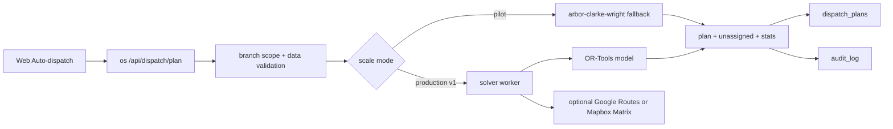

# Dispatcher architecture decision

Data decyzji: 2026-06-01  
Status: accepted for pilot and production v1

## Decyzja

ARBOR wybiera **self-hosted OR-Tools-compatible solver path** jako docelowa architekture dispatchera. Obecny solver w `os/src/services/vrp.js` zostaje pilotowym, deterministycznym fallbackiem w API, a produkcyjny krok po pilocie to wyniesienie solvera do workera/kolejki z interfejsem zgodnym z OR-Tools.

Zewnetrzne API mapowe nie jest wlascicielem decyzji VRP. Google Routes, Google Route Optimization albo Mapbox beda uzywane tylko pomocniczo:

- do macierzy czasu/dojazdu i ETA, gdy wlaczymy budzet API;
- do mapy planistycznej i wizualizacji;
- do walidacji jakosci tras w smoke/benchmarku.

## Dlaczego nie API jako glowny solver

Google Route Optimization jest mocne, ale koszt skaluje sie per shipment i dla wielu pojazdow wpada w SKU Fleet Routing. Oficjalna dokumentacja Google opisuje billing od liczby shipmentow i rozroznia Single Vehicle Routing oraz Fleet Routing; limity Optimize Tours i Batch Optimize Tours to 60 QPM. Oficjalna tabela cen Google pokazuje Fleet Routing z bezplatnym limitem 1,000 i stawka od 30 USD za 1,000 w pierwszym progu.

Mapbox Optimization API jest prostszy kosztowo i ma hojny prog darmowy, ale produktowo optymalizuje kolejnosc punktow w pojedynczym/multi-stop route request, a nie pelny model ARBOR: wiele ekip, kompetencje, sprzet, przerwy, branch scope, reczne blokady i przyczyny `unassigned`.

OR-Tools/self-hosted daje:

- brak kosztu zmiennego per plan;
- pelna kontrole nad kompetencjami, sprzetem, przerwami, max godzin, oddzialem i reczna korekta;
- mozliwosc pracy degraded, gdy API mapowe ma awarie albo limit;
- stabilny kontrakt `POST /api/dispatch/plan` dla web/mobile;
- latwe logowanie benchmarku i porownywanie jakosci planu.

## Obecny stan w repo

Pilotowy solver dziala lokalnie:

- `os/src/services/vrp.js` liczy trasy algorytmem Clarke-Wright;
- obsluguje okna czasowe, service time, wymagany sprzet, wymagane kompetencje, max godzin i przerwy;
- zwraca `unassigned` z powodami `no_teams`, `no_capable_team`, `time_window_missed`, `capacity_exceeded`;
- `os/src/routes/dispatch.js` wystawia `POST /api/dispatch/plan`, `plan/save`, `apply/:id` i dopina `solver_target_ms` oraz `solver_sla_ok`;
- odpowiedz solvera ma `stats.solver_engine = "arbor-clarke-wright"` jako jawny tryb pilotowy.

## Docelowa architektura

## Kontrakt solvera

Wejscie:

- `date`;
- `oddzial_id` po `scopedOddzialId`;
- lista zlecen z `pin_lat`, `pin_lng`, `czas_obslugi_min`, `okno_od`, `okno_do`, `priorytet`, `wymagany_sprzet_typ`, `wymagane_kompetencje`;
- lista ekip z depot, `max_godzin_dzien`, przerwami, dostepnym sprzetem i kompetencjami.

Wyjscie:

- `routes[].team_id`;
- `routes[].stops[]` z `task_id`, ETA, finish, travel/service/break;
- `unassigned[]` z reason i detalami;
- `stats.solver_engine`, `solver_ms`, `solver_target_ms`, `solver_sla_ok`, coverage.

Ten kontrakt zostaje stabilny niezaleznie od tego, czy silnik jest lokalny, OR-Tools worker, czy fallback.

## Koszt API - model kontrolny

Szacunek robimy na dzien planowania, nie na klikniecia UI:

| Wariant | Co jest platne | Koszt przy pilocie | Ryzyko |
|---|---:|---:|---|
| OR-Tools/self-hosted | CPU/RAM workera | 0 USD zmiennego API | Koszt implementacji i utrzymania workera |
| Google Route Optimization | shipmenty; Fleet Routing dla 2+ pojazdow | przy 1,100 shipmentach/mies. miesci sie blisko darmowego progu 1,000, nadwyzka po stawce Fleet Routing | koszt rosnie liniowo z liczba zlecen; wymaga quota i billing |
| Google Routes Matrix | elementy origin x destination | 50 zlecen x 10 ekip = 500 elementow na plan; 22 dni = 11,000 elementow/mies. | koszt rosnie kwadratowo przy pelnej macierzy stop-stop |
| Mapbox Optimization API | requesty optymalizacji | do 100,000 requestow/mies. free tier wg cennika | nie pokrywa pelnego modelu multi-team ARBOR jako glowny solver |
| Mapbox Matrix API | elementy macierzy | do 100,000 elementow/mies. free tier wg cennika | koszt i limity przy wielu oddzialach i odswiezaniu planu |

Przyklad skali docelowej: 6 oddzialow x 50 zlecen dziennie x 22 dni = 6,600 shipmentow miesiecznie. Google Fleet Routing po darmowym limicie moze wtedy przejsc w setki USD/mies. przy codziennym planowaniu, zanim doliczymy mapy, geokodowanie i ponowne przeliczenia. OR-Tools zachowuje koszt API na poziomie 0 USD dla samej decyzji VRP.

## Limity i guardy

- `DISPATCH_SOLVER_TARGET_MS` zostaje progiem runtime.
- Dla pilota `POST /api/dispatch/plan` moze liczyc synchronicznie w API.
- Dla produkcji wielooddzialowej solver idzie do workera z timeoutem, idempotency key i zapisem job status.
- Kazdy zewnetrzny provider musi miec dzienny limit/quota i metryke kosztu.
- Brak dostepu do API mapowego nie moze blokowac planowania; fallback to `arbor-clarke-wright` z Haversine.
- Plan zapisany w `dispatch_plans` musi zawierac `stats.solver_engine` i zrodlo macierzy czasu, gdy bedzie wlaczone.

## GO / NO-GO

GO dla EPIC 1.2:

- `npm run verify:dispatcher-adr` przechodzi.
- `npm run verify:scale-readiness` przechodzi.
- `POST /api/dispatch/plan` zwraca `stats.solver_engine`.
- Backlog EPIC 1.2 wskazuje ten ADR jako decyzje.
- Pilot uzywa lokalnego fallbacku bez kluczy Google/Mapbox.

NO-GO:

- Google/Mapbox jest glownym solverem bez limitow budzetowych.
- Planowanie wymaga zewnetrznego API do podstawowego przypisania ekip.
- Brak `unassigned.reason` po nieudanym planie.
- Brak `solver_sla_ok` albo `solver_engine` w statystykach.

## Zrodla cen i limitow

Sprawdzone 2026-06-01:

- Google Routes API usage and billing: https://developers.google.com/maps/documentation/routes/usage-and-billing
- Google Route Optimization usage and billing: https://developers.google.com/maps/documentation/route-optimization/usage-and-billing
- Google Maps Platform pricing list: https://developers.google.com/maps/billing-and-pricing/pricing
- Mapbox pricing: https://www.mapbox.com/pricing

